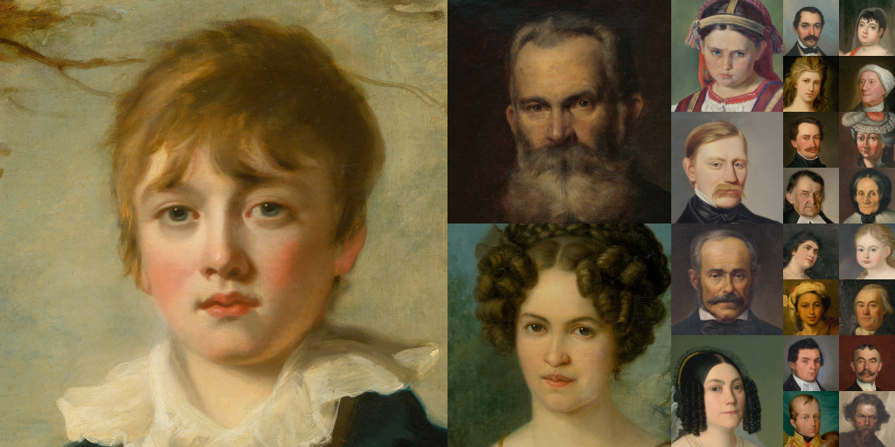

## SNGFaces Dataset


[](https://zenodo.org/badge/latestdoi/307103640)



SNGFaces is an image dataset of human faces extracted from incredibly high resolution scans (often over 0.5GB per scan) of oil paintings,
 heavily inspired by NVIDIA's [MetFaces dataset](https://github.com/NVlabs/metfaces-dataset).

The dataset consists of 621 high-quality PNG images at 2048&times;2048 resolution and
 a superset of 644 high-quality PNG images at 1024&times;1024.
  
The images were downloaded via the [on-line catalog of artworks](https://www.webumenia.sk/en) developed by [lab.SNG](https://github.com/SlovakNationalGallery): the digital R&D lab of the Slovak National Gallery (SNG),
 and automatically aligned and cropped using original MetFaces [preprocessing script](https://github.com/NVlabs/metfaces-dataset/blob/master/metfaces.py). Only images under public domain license were collected.

## Licenses

The source images are made available under the [Public Domain Mark 1.0](https://creativecommons.org/publicdomain/mark/1.0/).
 Please [read here](https://www.webumenia.sk/en/informacie) for more information about source's license policies.

The dataset itself (including JSON metadata, processed images, and documentation) is made available under [Creative Commons BY-NC 2.0](https://creativecommons.org/licenses/by-nc/2.0/). You can **use, redistribute, and adapt it for non-commercial purposes**, as long as you (a) give appropriate credit by **referencing this repository**, and (b) **indicate any changes** that you've made.


## Overview

All data is hosted on Google Drive:

| Path | Size | Files | Format | Description  
| :--- | :--: | ----: | :----: | :----------  
| [sngfaces-dataset](https://drive.google.com/drive/folders/1bqRq-nIXn5k-Q5Ua5aoU_vCJKhZPhscX) | 6.0 GB | 2023 | | Main folder  
| &boxvr;&nbsp;[sngfaces.json](https://drive.google.com/file/d/1gLdDOMmY3owY-O4T7mvvOGNb4xmTq4D2) | 0.3 MB | 1 | JSON | Image metadata  
| &boxvr;&nbsp;[unprocessed_previews](https://drive.google.com/drive/folders/1J7y2tGvdO8c3mM8-ehchxfNVBhyVgWdC) | 0.6 GB | 757 | PNG | Original unprocessed preview images at 800&times;(shorter size) resolution  
| &boxvr;&nbsp;[processed/2048](https://drive.google.com/drive/folders/1CznCoaCrm1jnLmPrbmuUgAPPt-5SZXHE) | 4.3 GB | 621 | PNG | Aligned and cropped images  at 2048&times;2048 resolution 
| &boxur;&nbsp;[processed/1024](https://drive.google.com/drive/folders/1_Ddr__nik0hov_1RObmkeeylZYLDa7Vx) | 1.1 GB | 644 | PNG | Aligned and cropped images  at 1024&times;1024 resolution

## Reproducing the dataset

Contrary to MetFaces, SNGFaces images can not be reproduced since the original full resolution images are not provided as
their total size is well over 100GB.

## Metadata

The `sngfaces.json` file contains the following information for each image:

```
{
   "SVK:SNG.O_4903":{
      "properties":{
         "id":"SVK:SNG.O_4903",                            # Inventory number of the paitning
         "author":"Kálmán Rudnyánszky",
         "title":"Portrait of Baron Gejza Mednyánszky",
         "date":"1855",
         "institution":"Slovenská národná galéria, SNG",
         "work type":"painting",
         "genre":"portrait",
         "material":"canvas",
         "technique":"oil"
      },
      "image_2048_md5":"9ecdeb74d5ab4d05ec3ab15ee49526c6", # MD5 checksum of the 2048x2048 image
      "image_1024_md5":"4bd63fc9a473c4d72a4c0778bf36cb74"  # MD5 checksum of the 1048x1048 image
   },
   ...
}
```

## Differences between SNGFaces and MetFaces
* SNGFaces source images are incredibly high quality color scans (majority has well over 10,000 pixels per image side and 100MBs of file size) coordinated by professional from [SNG's Department of Digital Collections and Services](http://2011.sng.sk/en/uvod/o-sng/useky-a-oddelenia/usek-vyskumu-a-rozvoja/cedvu-a-digitalne-zbierky).
As such SNGFaces contain unscaled images at pure 2048&times;2048 resolution. On the contrary, some amount of MetFaces images are [upscaled greyscale photographs](https://drive.google.com/drive/folders/1iChdwdW7mZFUyivKtDwL8ehCNhYKQz6D)
at 1024&times;1024 resolution.
* SNGFaces is exclusively made of portraits of oil paintings produced on canvas while MetFaces also includes other forms of art, such as sculptures. 
* As noted in Reproducing the dataset section, SNGFaces can not be reproduced contrary to MetFaces which include all source images and the processing script.